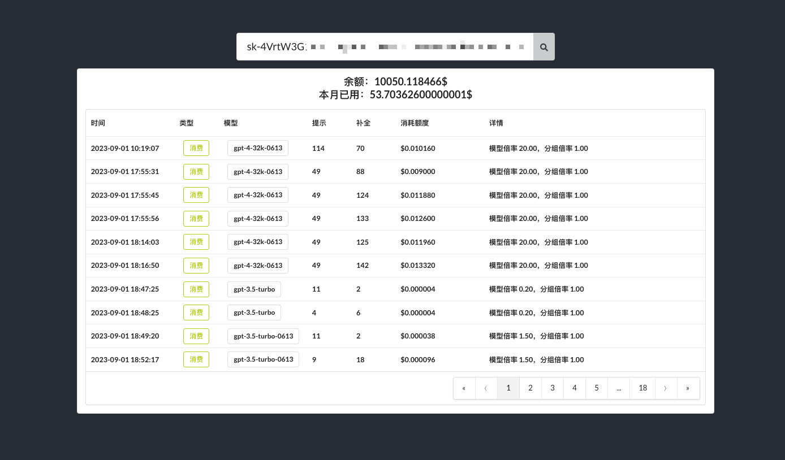

# 使用方法
复制.env.example文件为.env
```
cp .env.example .env
```
修改.env文件中的配置
```
# 展示使用明细
SHOW_DETAIL="false"

# 展示余额
SHOW_BALANCE="true"

# BaseURL 结尾不要带/
BASE_URL="https://api.gongxiangai.top"
```
Vercel部署环境变量
```
# 展示使用明细
REACT_APP_SHOW_DETAIL = false

# 展示余额
REACT_APP_SHOW_BALANCE = true

# BaseURL 结尾不要带/
REACT_APP_BASE_URL = https://api.gongxiangai.top
```
